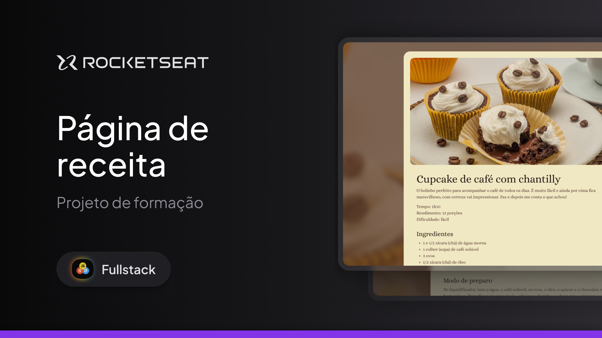

<h1 align="center"> Full-Stack </h1>

Curso para desenvolvimento Full-Stack, promovido pela Rocketseat para ensino de tecnologias WEB.

  <a href="#-tecnologias">Tecnologias</a>&nbsp;&nbsp;&nbsp;|&nbsp;&nbsp;&nbsp;
  <a href="#-layout">Layout</a>&nbsp;&nbsp;&nbsp;|&nbsp;&nbsp;&nbsp;
  <a href="#licença">Licença</a>

  

 

  

## 🚀 Tecnologias

Esse projeto foi desenvolvido com as seguintes tecnologias:

- HTML e CSS
- Git e Github
- Figma

## 🔖 Layout

Você pode visualizar o layout do projeto através [DESSE LINK](https://www.figma.com/design/lhseJ5pNinQSjYQatvx2Z4/P%C3%A1gina-de-receita--Community-?node-id=0-1&p=f&t=lIKWS9vf5NmJaMKV-0). É necessário ter conta no [Figma](https://figma.com) para acessá-lo.

## Licença

Esse projeto está sob a licença MIT.

---

Feito com ♥ by Rocketseat [Participe da nossa comunidade!](https://discord.gg/rocketseat)

[def]: github/preview.jp